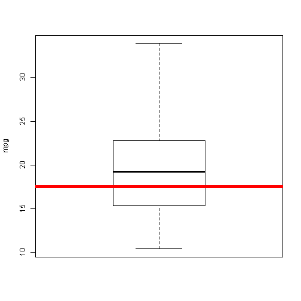

the prediction of the Miles/gallon of cars
========================================================
author: FanWuyou
date: June 20th, 2015
 
How to use.
========================================================
To predict the mpg, we need you to enter 10 variables in the left part.

And We give the prediction in the right part.

Plot
========================================================
The box plot is the distribution of mpg in the oiginal data.

The red line means our prediction.
 

Orignial Data
========================================================
We use the mtcars data in R as Original data.

It contians 11 variables of a car .

```r
names(mtcars)
```

```
 [1] "mpg"  "cyl"  "disp" "hp"   "drat" "wt"   "qsec" "vs"   "am"   "gear"
[11] "carb"
```

Predicition
========================================================
We use Multiple Linear Regression to make a model.
And use the data you give to predict.

```r
pre<-glm(mpg~.,data=mtcars)
ans<-function(cyl,disp,hp,drat,wt,qsec,
vs,am,gear,carb){
  a=data.frame(cyl,disp,hp,drat,wt,qsec,
vs,am,gear,carb)
  predict(pre,newdata=a)
}
```
